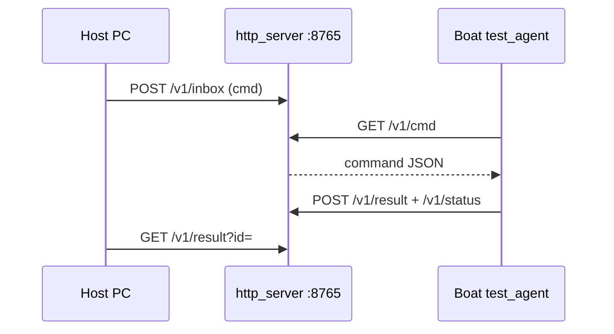

# Realtime in-game boat tests

**This is the source of truth for boat controls** — not `navigation/sim/`.

There are two host↔boat transports. **Multiplayer boats are not on your local Prism `saves/` disk** — `npm run list` will only see local SP computers (often cannon hubs). Use **HTTP** for MP.

| Mode | When | How |
|------|------|-----|
| **http** | Multiplayer (preferred) | Host `npm run serve`; boat polls `base_url` |
| **fs** | Singleplayer, or sshfs mount of server computer FS | Host R/W `realtime_*.json` under the computer folder |

## Multiplayer — HTTP poll (preferred)



### 1. Host config

```bash
cd cc-scripts/navigation/realtime_tests
cp bridge.example.json bridge.json
# mode=http, listen=0.0.0.0:8765, base_url=http://127.0.0.1:8765
npm run serve
```

Leave `serve` running. Note your LAN IP (e.g. `192.168.178.160`) — the **Minecraft server** must reach it (CC `http` is server-side).

### Topology check (LAN vs remote)

CC `http.get` runs on the **Minecraft server process**, not your game client.

| MC server location | Boat `base_url` must be |
|--------------------|-------------------------|
| Same LAN as your PC | `http://YOUR_LAN_IP:8765` (e.g. `192.168.178.160`) |
| Remote VPS / hosted (public IP in multiplayer list) | **Public tunnel** (ngrok / Cloudflare) pointing at host `:8765` — LAN IPs are unreachable |

**Detection:** if your multiplayer server address is a public IP (not `192.168.*` / `10.*`), you need a tunnel. Example: server `62.x.x.x:25565` cannot dial `192.168.178.160`.

Host firewall tip (if UFW is on): `sudo ufw allow 8765/tcp`

### 2. Ask the server admin (HTTP whitelist)

Default CC denies `$private` (LAN/localhost). That **blocks** host LAN IPs like `192.168.178.160` unless an **allow** rule is listed **above** the `$private` deny. **Rule order matters** — first match wins.

Admin snippet for `computercraft-server.toml` (allow MUST come before `$private`):

```toml
[[http.rules]]
	host = "192.168.178.160"
	port = 8765
	action = "allow"

[[http.rules]]
	host = "$private"
	action = "deny"
```

Also ensure `[http] enabled = true`.

**Prefer not to open LAN?** Run a Cloudflare tunnel or ngrok to the bridge, then allow that **public** hostname (and put it in the boat `base_url`) instead of the LAN IP — still place the allow rule **above** `$private`.

### Port already in use (`EADDRINUSE …:8765`)

```bash
ss -tlnp | grep 8765
# Confirm cmdline is node http_server.mjs (ours), then:
kill <PID>
# Or keep the old process and use another port everywhere:
PORT=8766 npm run serve
```

If you switch ports, boat `/realtime_bridge.json` and the admin allow rule must match:

```json
{ "mode": "http", "base_url": "http://192.168.178.160:8766", "poll": 0.3 }
```

```toml
[[http.rules]]
	host = "192.168.178.160"
	port = 8766
	action = "allow"
```

### 3. Boat agent config + deploy

On the boat computer create `/realtime_bridge.json` (see `realtime_bridge.example.json`):

```json
{ "mode": "http", "base_url": "http://192.168.178.160:8765", "poll": 0.3 }
```

Then `updater` → select `test_agent.lua` + navigation `lib/*`, calibrate if needed, run:

```text
test_agent
```

You should see `mode http` and `base …`. HTTP failures now print every poll with status + URL — if you see Domain not permitted / Connection refused, fix whitelist or topology first.

### 4. Run tests / dock

```bash
cd cc-scripts/navigation/realtime_tests
# Expect curl health agent_alive=true once boat heartbeats:
curl -s http://127.0.0.1:8765/v1/health
npm test
# after green:
node overnight_loop.mjs --once
# dock target is navigate_to x=340 z=165
```

On ping timeout, `npm test` prints last access-log lines. If you only see loopback host traffic and no boat `/v1/cmd` or `/v1/status`, the MC server never reached your PC.

## Singleplayer — filesystem

1. Boat chunk loaded; `updater` / `deploy_to_computer.mjs`; run `test_agent` (no `/realtime_bridge.json`, or `"mode":"fs"`).
2. Host: `cp bridge.fs.example.json bridge.json`, edit world + id, `npm run list`, `npm test`.

| File | Who writes | Purpose |
|------|------------|---------|
| `realtime_inbox.json` | Host | Command |
| `realtime_outbox.json` | Agent | Result |
| `realtime_status.json` | Agent | Heartbeat |

## Optional: remote FS via sshfs

If you have SSH to the server world files:

```bash
sshfs user@server:/path/to/world/computercraft/computer /mnt/cc-computers
```

`bridge.json`:

```json
{ "mode": "fs", "root": "/mnt/cc-computers", "computer_id": "12" }
```

Not required when HTTP works. Do not pretend local Prism discover finds an MP boat.

## What the suite checks

| Case | Expectation |
|------|-------------|
| `ping` | Agent replies |
| `load_control` | `/boat_control.json` loads |
| idle `apply 0,0,0` | Duties near zero |
| hold **W** | Real Δfwd and/or motor RPM actually sent |
| hold **S** (`fx=-1`) | Reverse Δfwd and/or motor RPM / strong negative net Fx |
| hold **A** (`tz=+1`) | Both sides lit; **Δyaw° < −4** (pilot left → negative pose yaw) |
| hold **D** (`tz=-1`) | **\|Δyaw\| ≥ 4** and opposite sign to A |
| stop between cases | Motors zeroed |

Commands: `ping`, `stop`, `load_control`, `sample_pose`, `apply`, `hold_apply`, `write_file`, `sync_tree`, `reboot` / `restart_agent`, `navigate_to` / `go_dock`, `go_port`, `follow_path`, `shutdown`.

## Offline soft-nav tests (no boat)

When you are not running `test_agent`, still verify soft arrive / gentle thrust / water-hold paths:

```bash
cd ../sim
npm test
```

See also `../OVERNIGHT.md` for pull + offline/live checklist.

## Host-owned Lua updates (no updater)

After **one** bootstrap of a `test_agent` that supports `write_file` / `sync_tree`:

```bash
# host
npm run serve          # already running
npm run deploy         # pushes navigation/*.lua + lib/*.lua over the bridge
# optional: npm run deploy -- --reboot   # os.reboot so new test_agent loads
npm test               # auto-deploys before the suite (SKIP_DEPLOY=1 to skip)
```

**One-time bootstrap** (boat computer — only if deploy says NEED_BOOTSTRAP):

```
wget https://raw.githubusercontent.com/Gleeglor/amazeballs-cc/main/navigation/test_agent.lua test_agent
test_agent
```

Or wget from the bridge: `<boat base_url>/v1/repo/navigation/test_agent.lua` (same host the boat already polls — never `127.0.0.1`).

## Safety

- Agent stops all motors on boot, between host `stop`s, after each hold, on quit, and if no host progress for ~3s while thrusting.
- Hold duration capped at 6s on the agent; holds drain motor RPM queues (CCA anti-spam) before measuring pose deltas.
