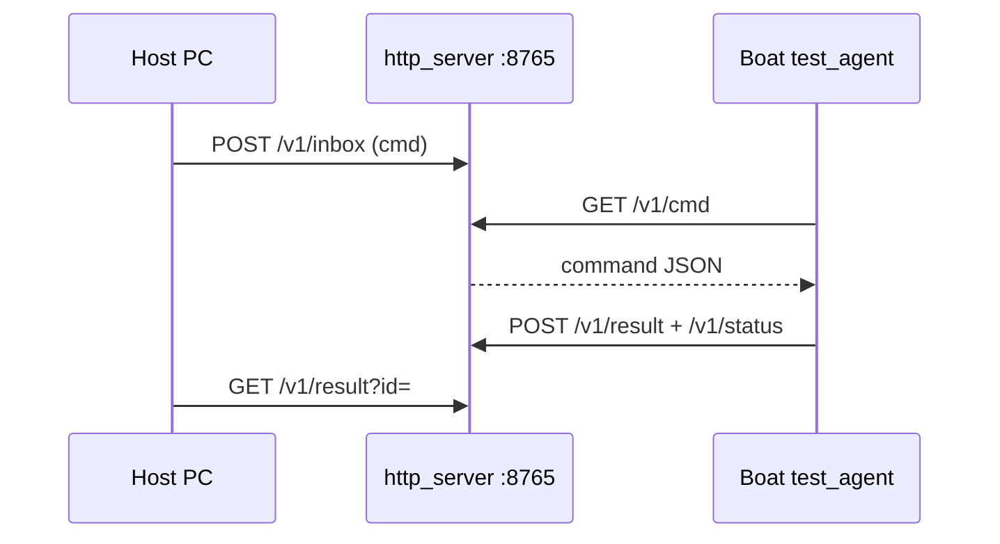

# Realtime in-game boat tests

**This is the source of truth for boat controls** — not `navigation/sim/`.

There are two host↔boat transports. **Multiplayer boats are not on your local Prism `saves/` disk** — `npm run list` will only see local SP computers (often cannon hubs). Use **HTTP** for MP.

| Mode | When | How |
|------|------|-----|
| **http** | Multiplayer (preferred) | Host `npm run serve`; boat polls `base_url` |
| **fs** | Singleplayer, or sshfs mount of server computer FS | Host R/W `realtime_*.json` under the computer folder |

## Multiplayer — HTTP poll (preferred)



### 1. Host config

```bash
cd cc-scripts/navigation/realtime_tests
cp bridge.example.json bridge.json
# mode=http, listen=0.0.0.0:8765, base_url=http://127.0.0.1:8765
npm run serve
```

Leave `serve` running. Note your LAN IP (e.g. `192.168.1.50`) — the **Minecraft server** must reach it (CC `http` is server-side).

### 2. Ask the server admin (HTTP whitelist)

Default CC denies `$private` (LAN/localhost). Admin must allow your host **before** the `$private` deny in `computercraft-server.toml`:

```toml
[[http.rules]]
	host = "192.168.1.50"
	port = 8765
	action = "allow"

[[http.rules]]
	host = "$private"
	action = "deny"
```

Or allow a tunnel hostname (`*.ngrok-free.app`, etc.) if you expose the bridge that way. Also ensure `[http] enabled = true`.

### 3. Boat agent config + deploy

On the boat computer create `/realtime_bridge.json` (see `realtime_bridge.example.json`):

```json
{ "mode": "http", "base_url": "http://192.168.1.50:8765", "poll": 0.3 }
```

Then `updater` → select `test_agent.lua` + navigation `lib/*`, calibrate if needed, run:

```text
test_agent
```

You should see `mode http` and `base …`. If HTTP is blocked, posts/gets fail — fix whitelist first.

### 4. Run tests / dock

```bash
cd cc-scripts/navigation/realtime_tests
npm test
# after green:
node overnight_loop.mjs --once
# dock target is navigate_to x=340 z=165
```

## Singleplayer — filesystem

1. Boat chunk loaded; `updater` / `deploy_to_computer.mjs`; run `test_agent` (no `/realtime_bridge.json`, or `"mode":"fs"`).
2. Host: `cp bridge.fs.example.json bridge.json`, edit world + id, `npm run list`, `npm test`.

| File | Who writes | Purpose |
|------|------------|---------|
| `realtime_inbox.json` | Host | Command |
| `realtime_outbox.json` | Agent | Result |
| `realtime_status.json` | Agent | Heartbeat |

## Optional: remote FS via sshfs

If you have SSH to the server world files:

```bash
sshfs user@server:/path/to/world/computercraft/computer /mnt/cc-computers
```

`bridge.json`:

```json
{ "mode": "fs", "root": "/mnt/cc-computers", "computer_id": "12" }
```

Not required when HTTP works. Do not pretend local Prism discover finds an MP boat.

## What the suite checks

| Case | Expectation |
|------|-------------|
| `ping` | Agent replies |
| `load_control` | `/boat_control.json` loads |
| idle `apply 0,0,0` | Duties near zero |
| hold **W** | Forward motion and/or net Fx |
| hold **A** (`tz=+1`) | Yaw activity; preferably both sides |
| hold **D** (`tz=-1`) | Δyaw opposite sign to A |
| stop between cases | Motors zeroed |

Commands: `ping`, `stop`, `load_control`, `sample_pose`, `apply`, `hold_apply`, `navigate_to` / `go_dock`, `shutdown`.

## Safety

- Agent stops all motors on boot, between host `stop`s, after each hold, on quit, and if no host progress for ~3s while thrusting.
- Hold duration capped at 4s on the agent.
